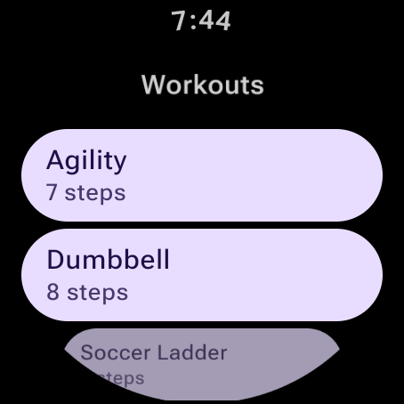
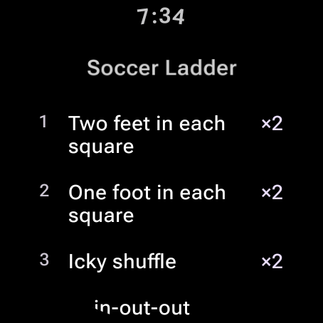
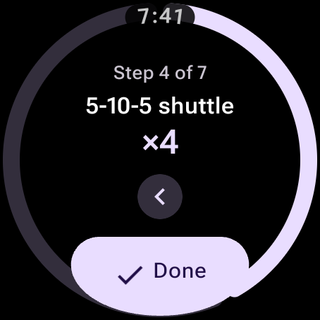
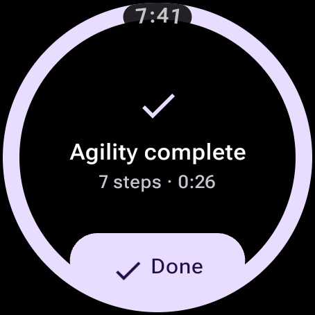
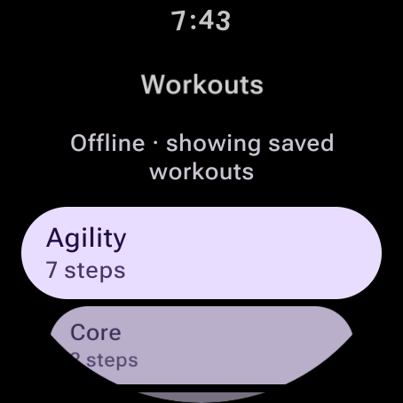
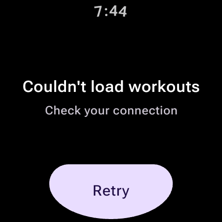

# Workout

A standalone Pixel Watch (Wear OS) app that walks you through a workout one step at a time.

Workouts live in this repo in one YAML file, `workouts/workouts.yaml`, in the order the watch
shows them. A GitHub Action compiles that file to a single JSON file and publishes it on GitHub
Pages; the watch fetches that file and caches it so it works offline.

```
workouts/workouts.yaml  ──(GitHub Action)──▶  workouts.json on GitHub Pages  ──(HTTPS)──▶  watch app
```

Published data: <https://aaronstacy.com/workout/workouts.json>

Download the app: every push to `main` rebuilds the APKs and publishes them as the
[latest release](https://github.com/aaronj1335/workout/releases/tag/latest) (`app-debug.apk` and
`app-release.apk`). Install with `adb install -r app-release.apk`.

| Workouts | Preview | Step | Complete |
|---|---|---|---|
|  |  |  |  |

Tap a workout to see its steps, **Start** to begin, then **Done** once per step. The ring around
the edge tracks how far through you are, and **‹** steps back. Swiping right leaves a workout.
If the watch is out of signal the last downloaded list is used:

| Offline | No data yet |
|---|---|
|  |  |

## Adding or editing a workout

Every workout is an entry in the `workouts:` list in
[`workouts/workouts.yaml`](workouts/workouts.yaml). The list order is the order the watch shows
them in, so move an entry up to move it up the list.

```yaml
workouts:
  - id: soccer-ladder          # required, lowercase slug, unique in the file
    name: Soccer Ladder        # required, shown in the watch list
    description: Agility-ladder footwork for soccer   # optional
    steps:                     # required, at least one
      - name: Icky shuffle     # required
        reps: 2                # required, integer >= 1
        notes: Lead with the outside foot   # optional, shown under the rep count
```

Open a pull request: CI validates the file and fails with the offending workout and field
(`workouts/workouts.yaml: /workouts/1/steps/0/reps must be an integer`, where `/workouts/1` is the
second entry in the list). Merging to `main` recompiles and redeploys, and the watch picks it up
on the next refresh.

Keep names short — they have to be readable on a watch face at arm's length. Workout names are
capped at 40 characters, step names at 60, and descriptions and notes at 120; reps must be a whole
number from 1 to 999. Unknown keys are an error, so a typo cannot silently drop a field, and two
workouts cannot share an id. The compiler
([`src/andersonstacy/workout/tools/`](src/andersonstacy/workout/tools/)) is Kotlin, reads the file
into the app's own catalog model, and writes it back out as JSON.

## Building

Everything is built with [Bazel](https://bazel.build); install
[Bazelisk](https://github.com/bazelbuild/bazelisk) (`brew install bazelisk`) and it fetches the
Bazel version in `.bazelversion`, a JDK, the Kotlin compiler, and the Android SDK on first use. Nothing else needs
to be installed, Android Studio included.

```bash
bazel test //...          # unit tests, workout validation, and a build of the APK and catalog
bazel build //src:app         # debug APK: bazel-bin/src/app.apk
bazel build -c opt //src:app  # release APK, same path
bazel build //workouts:dist   # bazel-bin/workouts/dist/{workouts.json,index.html}
```

`.bazelrc` records acceptance of the Android SDK license
(`ACCEPTED_ANDROID_SDK_LICENSE_VERSION`), which is what lets the SDK download run unattended.

The APK carries native libraries for both `armeabi-v7a` and `arm64-v8a` (`--android_platforms` in
`.bazelrc`) whatever the host machine is. Pixel Watches run a 32-bit userspace on a 64-bit chip,
and an APK built only for the host CPU fails to install with `INSTALL_FAILED_NO_MATCHING_ABIS`.
The only native code is a prebuilt library inside an androidx
AAR, so instead of an NDK the build registers a stub C++ toolchain (`tools/android_cc`) that
satisfies `android_binary` and never runs.

### The data

`bazel build //workouts:dist` compiles the YAML; `bazel test //src:validate_workouts_test`
checks it without writing anything. To run the compiler by hand:

```bash
bazel run //src:build_workouts -- --check workouts/workouts.yaml   # or the workouts/ directory
bazel run //src:build_workouts -- --out /tmp/dist workouts/workouts.yaml
```

### The app

`bazel build //src:app` produces a debug APK signed with the standard Android debug key.
`bazel build -c opt //src:app` produces the release variant (which, unlike debug, does not allow
cleartext HTTP) at the same path, `bazel-bin/src/app.apk`, so copy one aside if you want both.
It is signed with the same debug key — fine for `adb install`, not for the Play Store. CI builds
both on every push to `main` and attaches them to the `latest` release.

By default the app fetches the published Pages URL. To point a debug build at a local copy:

```bash
python3 -m http.server 8000 --directory bazel-bin/workouts/dist
bazel build //src:app --//:workouts_url=http://10.0.2.2:8000/workouts.json
```

(`10.0.2.2` is the host machine as seen from an emulator.)

Unit tests cover the catalog parsing, the cache/refresh rules and the session state machine:

```bash
bazel test //src/...
```

### Updating dependencies

Maven (`MODULE.bazel`): edit the artifact list, then `REPIN=1 bazel run @maven//:pin` to refresh
`maven_install.json`. Transitive androidx dependencies are pinned explicitly because androidx
publishes exact-version constraints between its own artifacts, which the resolver cannot
otherwise reconcile.

## Running it on an emulator

```bash
sdkmanager --install "system-images;android-35-ext15;android-wear;arm64-v8a"
avdmanager create avd -n pixel_watch5 -d wearos_large_round -k "system-images;android-35-ext15;android-wear;arm64-v8a"
emulator -avd pixel_watch5 -no-snapshot -gpu host
```

That gives a 454x454 round Wear OS 5.1 device, the same size as a 45 mm Pixel Watch. Two things
to know: the Wear OS 7.0 (`android-37.0`) image segfaults during boot with emulator 37.1.11, and
`-no-snapshot` is needed on a fresh AVD or the emulator quits trying to load a snapshot that is
not there. Then `adb install -r bazel-bin/src/app.apk`.

## One-time setup

GitHub Pages must be enabled for the deploy job to succeed:
**Settings → Pages → Source: GitHub Actions**.

The app fetches from the custom domain (`aaronstacy.com`) directly. The `github.io` address
redirects there over plain HTTP, which release builds refuse, so turn on **Enforce HTTPS** on the
same settings page if the app is ever pointed back at `github.io`.
